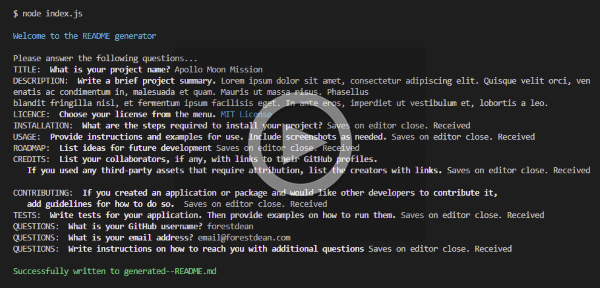
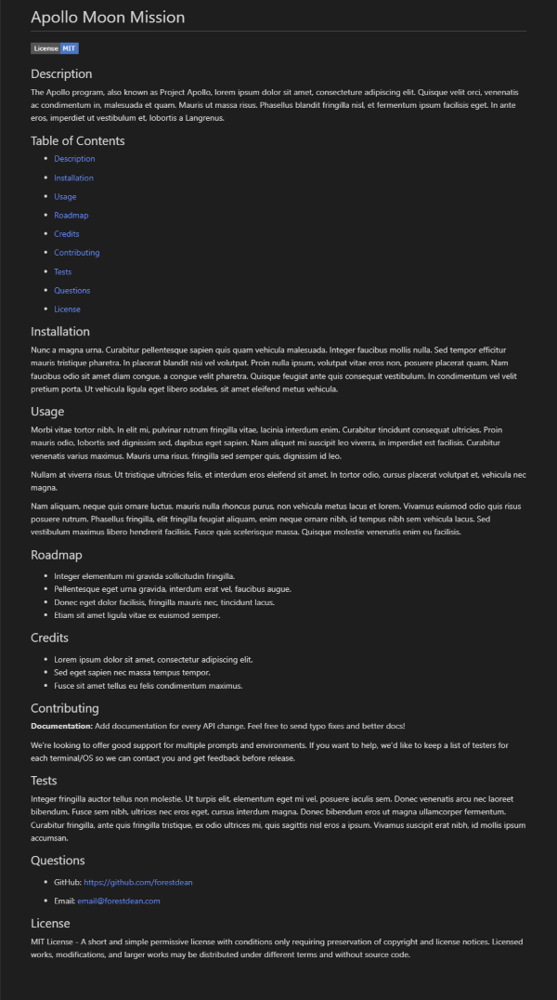

# Professional README Generator

## Description

When creating an open source project on GitHub, it’s important to have a high-quality README for the app. This should include what the app is for, how to use the app, how to install it, how to report issues and how to make contributions. A roadmap for future development may inspire a reader to contribute and crediting sources may not just be a professional courtesy but a legal requirement.

## Table of Contents
- [Description](#description)
- [Installation](#installation)
- [Usage](#usage)
- [Roadmap](#roadmap)
- [Credits](#credit)
- [Questions](#question)
- [License](#license)

## Installation

Directory must be downloaded to a Node.js environment.  
Relevent dependancies can be installed with `npm install`   
The app is initialised with the terminal command `node index.js`

## Usage

This video link illustrates the usage of the **Professional README Generator**: 

     

Here is an example of a **README** generated by the app:  

A sample **generated--README.md** can be found in the root directory.

## Roadmap

- progress bar with `inquirer.ui.BottomBar`
- improve terminal styling
- internal text editor
- store license badges locally

## Credits

- Modules in JavaScript - CommonJS and ESmodules Explained - https://www.freecodecamp.org/news/modules-in-javascript
- npm Inquirer v9 - https://unpkg.com/browse/inquirer@9.2.6/README.md
- npm Chalk - https://www.npmjs.com/package/chalk
- Licence information - https://choosealicense.com/appendix/
- License Badges - https://shields.io/category/license

## Questions

- GitHub: https://github.com/forestdean   
- Email: email@forestdean.com   

## License

MIT License - A short and simple permissive license with conditions only requiring preservation of copyright and license notices. Licensed works, modifications, and larger works may be distributed under different terms and without source code.
